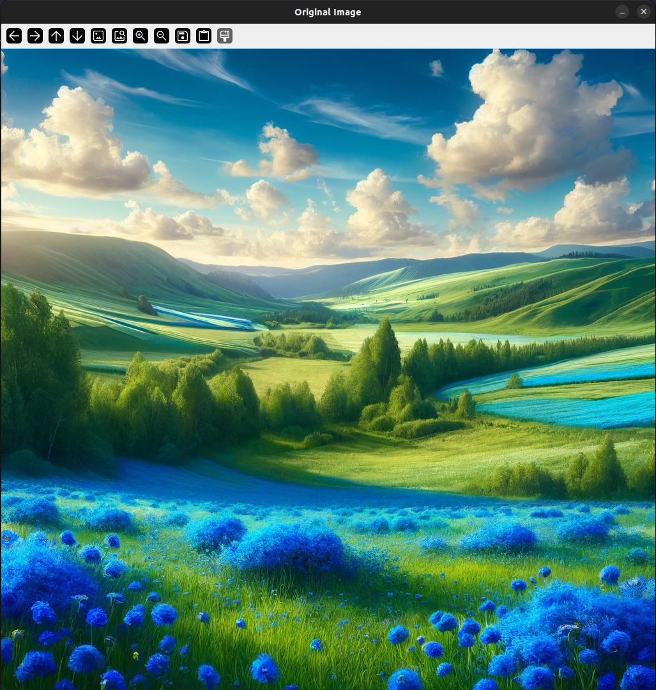
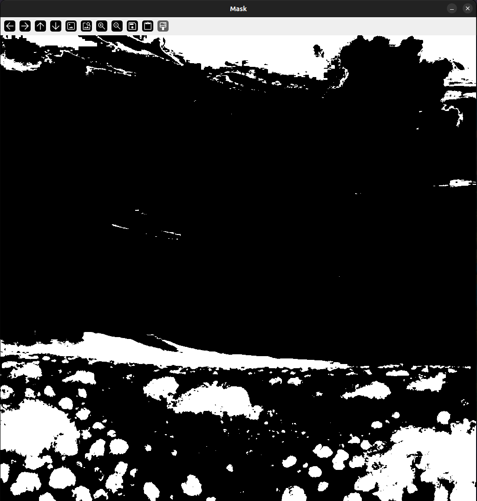
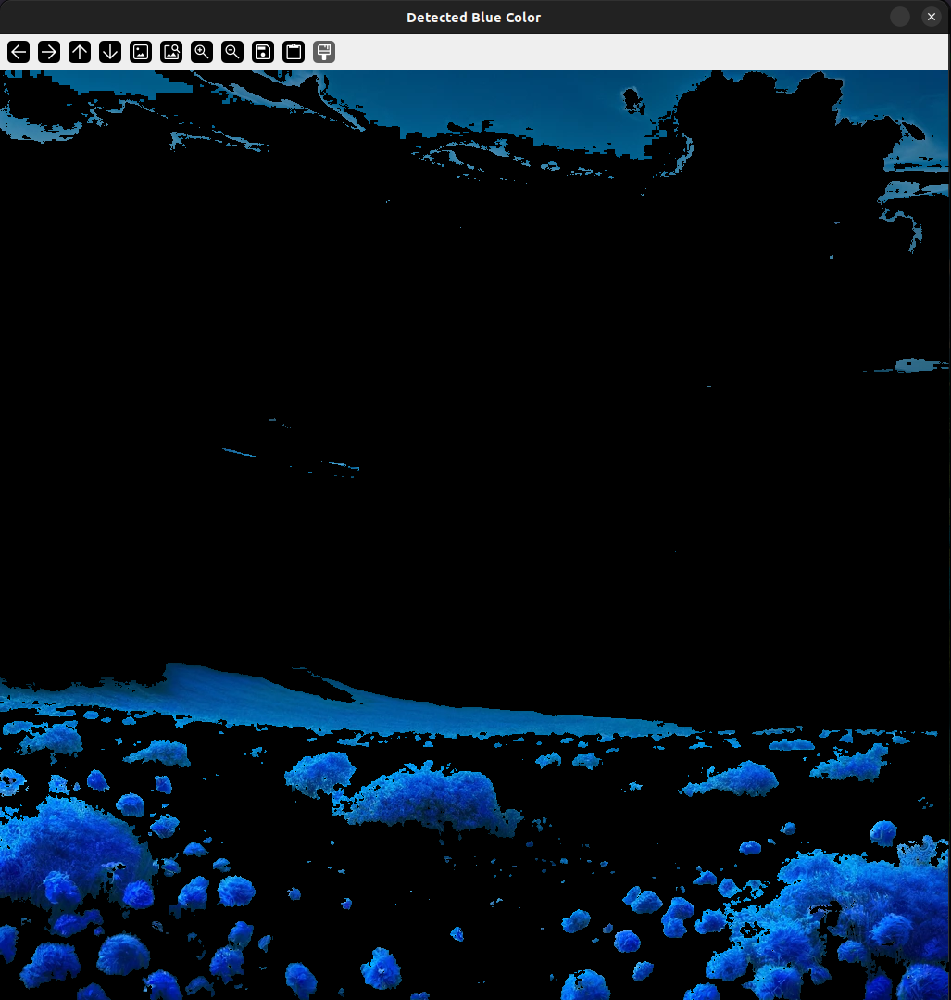

# Blue Color Detection and Masking

## Information

This Python script uses the OpenCV library to detect blue-colored regions in an image and mask those regions. The script loads an image, converts it to the HSV (Hue, Saturation, Value) color space, and defines a specific blue color range to detect pixels within that range. The detected blue pixels are then masked and displayed on the original image.

## Requirements

To run this script, you need the following:

- Python 3
- OpenCV (`cv2`) library
- NumPy (`numpy`) library
- An image file to detect blue color (`test_image.jpg`)

To install the required libraries, use:

```
    pip install opencv-python numpy
```

## Execution

1. Save the code in a Python file (e.g., `blue_detection.py`).
2. Place the image file (e.g., `test_image.jpg`) in the same directory or update the path in the script accordingly.
3. Run the following command in the terminal or command prompt:
    ```
    python3 blue_detection.py
    ```

## Output

When the script is executed, three different windows will open with the following outputs:

- **Original Image**: The original image
- **Mask**: A mask image where blue-colored regions are white (255) and other regions are black (0)
- **Detected Blue Color**: The result image showing only the blue-colored regions

### Example Outputs

#### Original Image


#### Mask


#### Detected Blue Color

