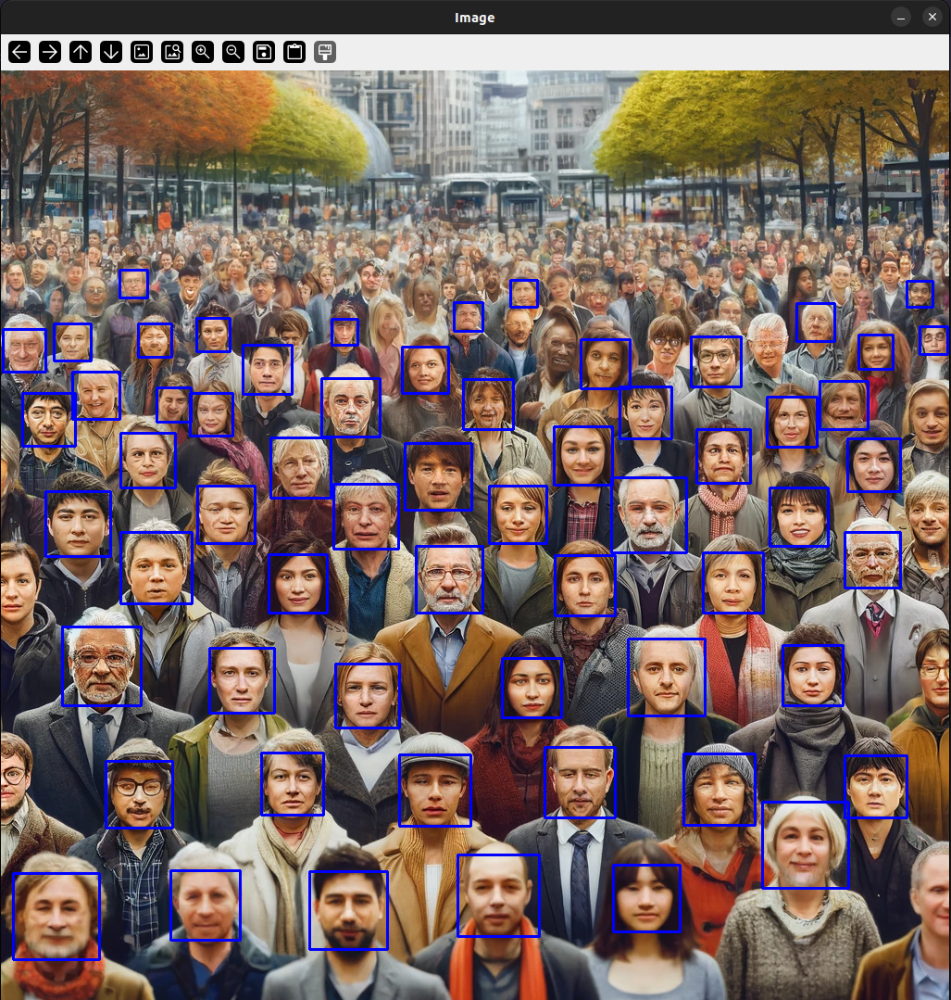

# Face Detection with Haar Cascades

## Information

This Python script uses the OpenCV library to detect faces in an image. The script employs a pre-trained Haar Cascade classifier to identify faces and draws rectangles around the detected faces.

## Requirements

To run this script, you need the following:
- Python 3
- OpenCV (`cv2`) library
- An image file for face detection (`test_image_3.jpg`)

To install the required libraries, use:

```
pip install opencv-python
```
## Execution

Save the code in a Python file (e.g., `face_detection.py`).
Place the image file (e.g., `test_image_3.jpg`) in the same directory or update the path in the script accordingly.
Run the following command in the terminal or command prompt:

```
python face_detection.py
```

## Output

When the script is executed, a window will open displaying the image with rectangles drawn around the detected faces.

### Example Outputs

#### Detected Faces

