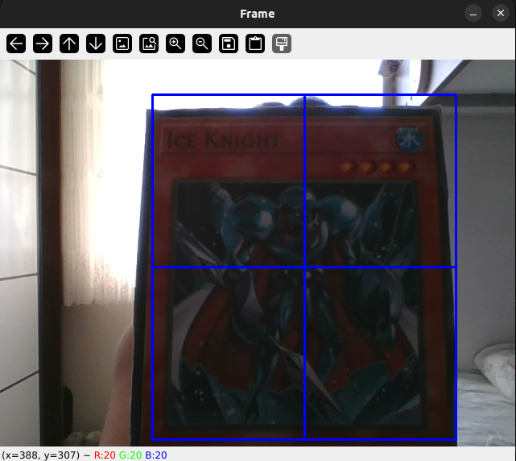
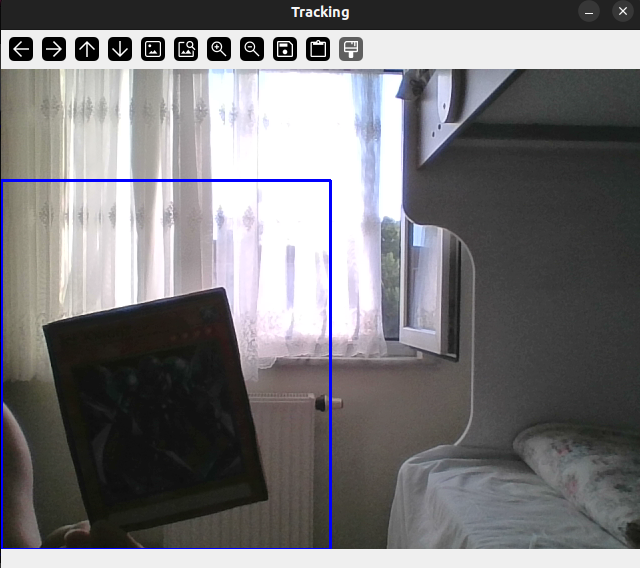

# Object Tracking with Video Monitoring

## Information

This Python script uses the OpenCV library to perform object tracking in a video stream. It creates a tracker using the KCF (Kernelized Correlation Filters) algorithm and tracks the ROI (Region of Interest) area selected by the user.

## Requirements

To run this script, you need the following:

- Python 3
- OpenCV (`cv2`) library

To install the required library, use:

```
pip install opencv-contrib-python
```
## Execution

Save the code in a Python file (e.g., object_tracking.py).

Run the following command in the terminal or command prompt:

```
python object_tracking.py
```

## Output

When the script is executed, the camera will open and the user will be prompted to select the area of the object to be tracked. After selection, the object will be tracked, and a rectangle will be drawn around the tracked object. The program can be exited by pressing the 'q' key.

### Example Outputs

#### Selected Object


#### Tracked Object


